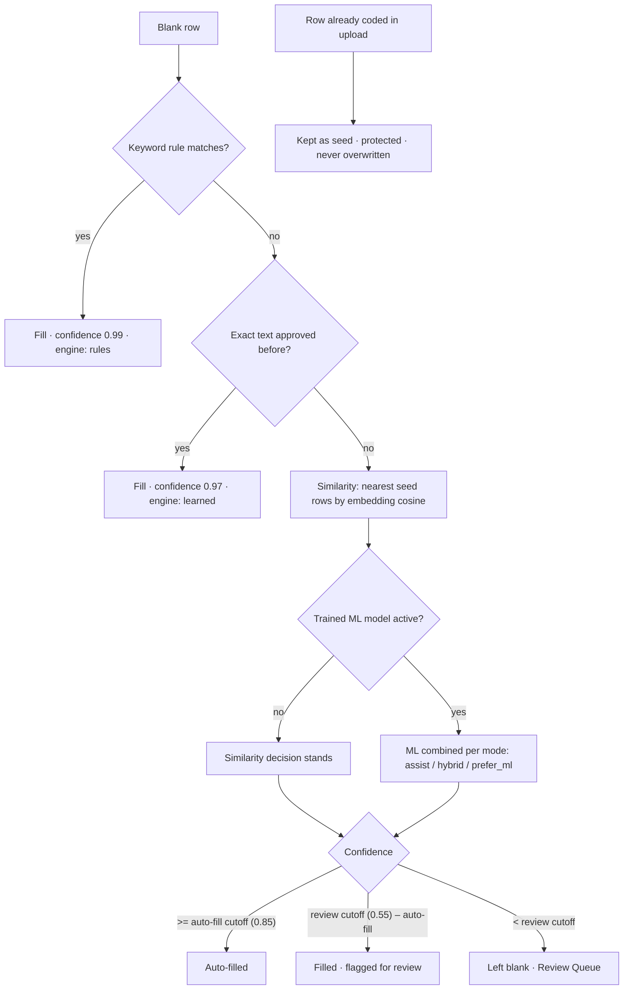

# Code_Down_ML

Transaction classification, automated. Upload a GL or transaction export, code a
few rows (or write a few keyword rules), and Code_Down_ML propagates the right
**account code** to every similar transaction. Every automated fill carries a
confidence score and a plain-language reason. Anything uncertain goes to a review
queue. Existing codes are never overwritten.

Spreadsheet-first. Your data stays in an editable grid. Every decision is
auditable. Nothing is a black box.

Runs locally. No login. No external service required.

---

## How a row gets a code

For each blank row, the engine walks a layered cascade and stops at the first
confident answer. Each fill records which layer decided it, the confidence, and
why.



The layers, in priority order:

1. **Seeds.** Any code already in the file (or typed by you) is kept as-is and
   becomes ground truth the other layers learn from.
2. **Keyword rules.** Deterministic phrase → code mappings you write. Match
   types: `contains`, `exact`, `starts_with`, `ends_with`, `fuzzy`, `regex`.
   Multiple comma-separated phrases per rule (OR logic). Row-wide by default;
   optionally scoped to named columns. Priority-ordered. Stored in SQLite and
   reused across files.
3. **Learned memory.** Exact text-signature matches to codes you approved
   before.
4. **Similarity.** Blank rows are embedded and compared against seed rows.
   Confidence = best cosine similarity weighted by agreement among the similar
   seeds. DBSCAN groups look-alike transactions for visibility.
5. **Trainable ML (optional).** A trained model layers on top of the similarity
   decision when one exists and the mode allows it. High-confidence agreement
   auto-fills; disagreement between ML and similarity is sent to review.

Confidence cutoffs and the similarity threshold live in `config.yaml` and are
adjustable live from the sidebar.

---

## Engines

Built in (install and go):

- **TF-IDF similarity** — char n-gram (3–5) vectorizer from scikit-learn. Fast.
  No downloads.
- **Logistic Regression** — TF-IDF + LogReg pipeline trained on your approvals.
  The always-available ML baseline.

Optional (`pip install -r requirements-semantic.txt`):

- **Semantic matching** — `sentence-transformers` embeddings
  (`all-MiniLM-L6-v2`, ~80 MB, downloads on first use). Matches on meaning, not
  spelling.
- **SetFit** — few-shot transformer classifier. The most accurate trainable
  layer. Trains on CPU.

Every optional engine degrades gracefully: missing packages never crash the app,
it just falls back to TF-IDF + LogReg.

The ML layer has four modes (`auto`, `similarity_only`, `hybrid`, `prefer_ml`).
`auto` is progressive: it leans on similarity when few approved examples exist
and shifts toward the trained model as approvals accumulate (thresholds in
`config.yaml`: `hybrid_min`, `ml_primary_min`).

---

## Quick start

Requires **Python 3.11+**.

```bash
git clone https://github.com/DannyBarren/Code_Down_ML.git
cd Code_Down_ML

python3 -m venv .venv
source .venv/bin/activate          # Windows: .venv\Scripts\activate

pip install -r requirements.txt    # core engine
# optional, heavier: semantic matching + SetFit
# pip install -r requirements-semantic.txt

streamlit run main.py
```

Open <http://localhost:8501>. On the dashboard, click **Load sample dataset**
(neutral, fictional vendors), then **Run Rules — Strict ★ (recommended)** in
the toolbar for a deterministic, fully audited first pass. Rows no rule covers
can then be picked up with **Full Intelligent Run** and finished in the
**Review** workspace.

`python main.py` also works — it relaunches itself under Streamlit. If core
packages are missing, the app shows a setup screen with a one-click installer
instead of crashing.

---

## Run modes

Four modes in the spreadsheet toolbar, ordered by trust (recommended first):

| Mode | What it uses | When |
| --- | --- | --- |
| **Run Rules — Strict ★ (recommended)** | Only your enabled keyword rules, blank rows only | Deterministic and auditable. Fills nothing a rule didn't match. |
| **Rules + Memory** | Strict rules, then exact matches you approved before | Deterministic coverage from past approvals. |
| **Run Rules + Similarity** | Rules first, then similarity spread from rule-filled + coded rows | Propagate rule codes to look-alike transactions. |
| **Full Intelligent Run** | Rules + learned memory + ML + similarity, whole file | Broadest coverage in one click. Can fill rows no rule matched — review those. |

Strict mode never leaks across accounts. Existing values are never overwritten
in any mode. When the nearest seed rows disagree on a code, the row goes to
review with the vote split instead of being silently filled. **Reset run**
un-runs the last pass and keeps your rules, notes, and manual edits.

---

## Review and learning

- The **Review workspace** (sidebar) shows only rows that need a human, least
  confident first, with the code, engine, confidence and a plain-English *why*
  on every row. Similarity groups approve in one click (split groups never
  do). Bulk actions approve everything visible or above a confidence cutoff;
  selected rows can be re-coded or rejected in bulk. Rejecting blocks the bad
  pairing from being suggested again — and never learns it.
- Approving a row writes the code, protects it, and records three things: a
  learned mapping (instant exact-match memory), a training example (feeds the
  ML models) and a reinforcement of the account's knowledge profile.
- **Rule Notes** is a per-row free-text column. Notes fold into the similarity
  text and persist across uploads via a stable row signature. They are never
  mined for rule keywords — suggestions come from Name, then Memo, then
  Description.
- The **Account Knowledge** base learns what each account code looks like —
  keywords, sample transactions, usage count — and adds that context to match
  rationales.
- **Models** panel: engine status, a memory inspector (mappings, examples,
  last train, held-out accuracy, delete-a-bad-mapping), and a quiet "train
  now" reminder after every 25 new approvals. **History** panel: past runs.
- Rules, learned mappings, training data and account profiles are scoped per
  client (the dashboard's client/project name), so switching clients never
  leaks one book's memory into another's.

---

## Export

- **Excel** — reopens your original workbook and writes only the `New Account`
  column back. Formatting, formulas, column order, and other sheets stay intact.
  Adds a **Code Down Summary** tab.
- **CSV** — tidy, internal columns stripped, codes normalized, optional derived
  `New Account (Base)` column. Ready to import into accounting/ERP tools.

---

## Configuration

All thresholds and column mappings live in **`config.yaml`**. Most are also
adjustable from the sidebar's **Advanced tuning** section.

- `similarity` — embedding model, similarity threshold (0.72), clustering,
  numeric-token stripping.
- `confidence` — auto-fill cutoff (0.85), review cutoff (0.55), rule/learned
  match confidences.
- `ml` — enable/disable, mode, confidence cutoff, SetFit settings, progressive
  thresholds, model store directory, `auto_train_every` (approvals between
  train reminders, default 25).
- `columns` — header variants recognized as the target `New Account` column, the
  text columns used for similarity (vendor-first: Name, Memo, Description…),
  amount and date columns, plus `keyword_source` / `keyword_source_exclude`
  controlling which columns rule suggestions are mined from (notes are never
  mined unless explicitly opted in).
- `account_glossary` — optional NARPM-style code → name/keywords mapping that
  enriches rationales. Empty by default; never required.
- `storage` / `logging` — SQLite path, work dir, log file.

Runtime data (SQLite DB, trained models, caches, logs) goes under a writable
data directory: `FILLDOWN_DATA_DIR` if set, else `./data/`, else a temp dir.
The app never crashes on a read-only filesystem. A hosted **live** instance
(`FILLDOWN_LIVE=1`) is the exception: if the configured dir is not writable it
fails visibly instead of falling through to `/tmp`.

| Variable | Default | Purpose |
| --- | --- | --- |
| `FILLDOWN_DATA_DIR` | `data/` | Writable root for DB / models / logs. |
| `FILLDOWN_DB_PATH` | under data dir | Override the SQLite DB path (used by tests). |
| `FILLDOWN_DEMO` | `0` | `1` enables public-demo behavior (banner, sample auto-load, fresh-state reset). |
| `FILLDOWN_DEMO_RESET` | `1` in demo | `0` keeps data across restarts in demo mode. |
| `FILLDOWN_LIVE` | `0` | `1` enables the hosted client instance (auth, persist workbook, never auto-wipe). |
| `FILLDOWN_AUTH_PASSWORD` | unset | Shared password. Required when `FILLDOWN_LIVE=1`; ignored locally. |
| `FILLDOWN_MAX_ROWS` | `0` | Soft per-upload row cap (`0` = unlimited). |

Locally there is no authentication gate. The app opens straight to the dashboard.

---

## Docker

```bash
docker build -t code-down-ml .
docker run -p 8501:8501 code-down-ml
```

The image builds on the core requirements (TF-IDF + LogReg), exposes port 8501,
and sets `FILLDOWN_DEMO=1` with the data dir at `/data` — mount a volume there
to persist rules and learning. That image is the **public demo**. It auto-loads
the sample dataset and can wipe the knowledge base on start. Do not hand it to
a client.

### Hosted client instance (Railway)

For a password-gated instance whose rules, approvals, **and last coded
workbook** survive restarts and deploys, see
**[docs/RAILWAY.md](docs/RAILWAY.md)**. That path uses `Dockerfile.railway`
(`FILLDOWN_LIVE=1`), mounts a volume at `/data`, and never auto-wipes client
data.

---

## Project structure

```
code_down_ML/
├── main.py                     # Streamlit entry point (thin router)
├── cli.py                      # `code-down` console script (pip install -e .)
├── config.yaml                 # thresholds + column mapping
├── requirements.txt            # core engine (lightweight)
├── requirements-semantic.txt   # optional semantic AI + SetFit
├── pyproject.toml              # packaging + pytest config
├── Dockerfile                  # HF public-demo image (FILLDOWN_DEMO=1)
├── Dockerfile.railway          # hosted client instance (FILLDOWN_LIVE=1)
├── railway.toml                # Railway build → Dockerfile.railway
├── docs/RAILWAY.md             # operator steps for the live instance
├── .streamlit/config.toml      # theme + server settings
├── src/                        # engines and business logic
│   ├── config.py               #   typed config, env vars, data-dir selection
│   ├── data_loader.py          #   read/normalize files, resolve New Account
│   ├── ingest_profiles.py      #   AppFolio/QuickBooks export-shape detection
│   ├── insights.py             #   read-only coaching metrics (pure functions)
│   ├── rules_manager.py        #   keyword rules, matching, account knowledge
│   ├── fill_down_engine.py     #   the decision cascade + confidence scoring
│   ├── similarity.py           #   embeddings (semantic or TF-IDF) + grouping
│   ├── ml_classifier.py        #   LogReg + SetFit training, registry, predict
│   ├── review_queue.py         #   build/apply the human review queue
│   ├── spreadsheet_helpers.py  #   work_df logic: runs, audit, reset, filters
│   ├── dependencies.py         #   dependency probes + in-app pip installer
│   └── exporter.py             #   Excel/CSV export
├── ui/                         # Streamlit views
│   ├── landing.py              #   dashboard: client name, upload, sample data
│   ├── spreadsheet.py          #   main grid, toolbar, run modes, export, append
│   ├── review.py               #   review workspace: groups, bulk approve/reject
│   ├── insights.py             #   read-only coaching metrics page
│   ├── panels.py               #   Rules / Models / History modals
│   ├── rule_creation.py        #   rule builder dialog + suggestion banners
│   ├── sidebar.py              #   nav, engine status, advanced tuning
│   ├── common.py               #   bootstrap, session state, demo/live mode, CSS
│   ├── live_gate.py            #   shared-password gate (live only)
│   ├── setup.py                #   dependency installer screens
│   └── guide.py                #   in-app user guide
├── utils/
│   ├── storage.py              #   SQLite: rules, memory, notes, training, runs
│   ├── session_store.py        #   live workbook persistence (off unless live)
│   ├── account_codes.py        #   account-code parsing and normalization
│   ├── sample_data.py          #   neutral sample dataset generator
│   ├── demo_utils.py           #   demo-mode data reset
│   └── logging_setup.py        #   structlog configuration
├── models/schemas.py           # pydantic models
├── data/sample_transactions.*  # neutral sample ledger (fictional vendors)
└── tests/                      # pytest suite + smoke_test.py
```

---

## Testing

```bash
pytest                   # unit + integration + headless UI tests
python smoke_test.py     # end-to-end smoke test without Streamlit
```

The suite covers the data loader, rules and matching, the decision cascade, the
ML layer, review and export, the spreadsheet helpers, and end-to-end UI flows
via Streamlit's `AppTest`. Tests use a throwaway SQLite database
(`FILLDOWN_DB_PATH`) and never touch shipped data.

---

## License

MIT — see [LICENSE](LICENSE). Copyright 2026 Danny Barren.
